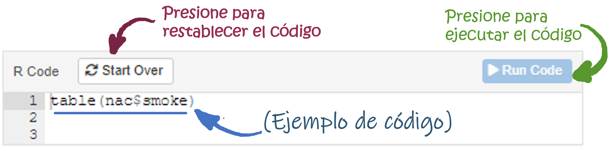
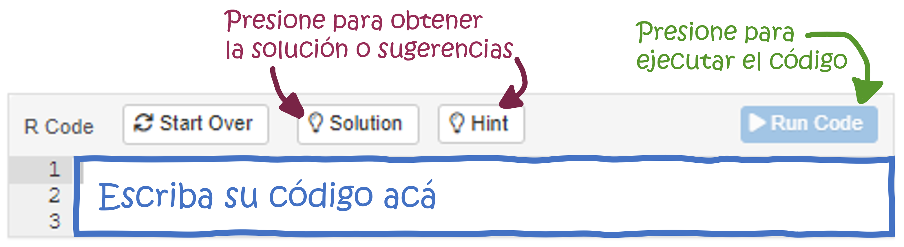

```{r setup, include=FALSE}
# Attach packages:

library(learnr)
library(fontawesome)
library(ggplot2)
gradethis::gradethis_setup()
tutorial_options(exercise.timelimit = 60)

# Global code chunk settings:
knitr::opts_chunk$set(echo = FALSE)

# data
load("data/nac.rdata")
```

## 1. Introducción

```{r, echo=FALSE, out.width="100%", fig.align = "center"}
  
```

<a rel="license" href="http://creativecommons.org/licenses/by-nc-sa/4.0/"></a><br />Este
obra está bajo una
<a rel="license" href="http://creativecommons.org/licenses/by-nc-sa/4.0/">licencia
de Creative Commons Reconocimiento-NoComercial-CompartirIgual 4.0
Internacional</a>.

Este taller tiene como objetivo introducir el análisis de datos
empleando el programa estadístico [R](https://cran.r-project.org/).

Los temas que serán cubiertos en este taller son:

1.  Cálculo de estadísticas descriptivas: tendencia central y
    dispersión.
2.  Cálculo de frecuencias absolutas y relativas, tablas de frecuencias.
3.  Construcción de gráficos estadísticos

### 

### ¿Cómo desarrollar este tutorial?

A lo largo del tutorial, encontrará ejemplos de código, ejercicios de
programación y preguntas de análisis. Los ejemplos de código y los
ejercicios pretenden introducir habilidades básicas de R. No es
necesario tener conocimientos previos sobre R para el desarrollo de este
tutorial.

#### `r fa("fas fa-robot", fill = "orange")` = Ejemplo de código

El icono del robot identifica los ejemplos de código a lo largo del
tutorial. Estos ejemplos incluyen código preescrito y funcional que
puede explorar y ejecutar al presionar el botón 'Run code' en la esquina
superior derecha.

```{r, echo=FALSE, out.width="100%", fig.align = "center"}
  
```

Puede explorar y modificar libremente el código del ejemplo, **no hay
forma de dañar el código de ejemplo**. Si realiza cambios en alguno de
los ejemplos y recibe un mensaje de error, simplemente haga clic en el
botón 'Start Over' en la esquina superior izquierda, y el código se
restablecerá automáticamente a su configuración predeterminada.

#### `r fa("fas fa-keyboard", fill = "green")` = Ejercicio de código

El icono del teclado señala ejercicios de práctica en los que deberá
ingresar el código manualmente para obtener los resultados que
solucionen las preguntas planteadas. Si siente que se ha quedado sin
ideas o no sabes cómo continuar con el ejercicio, simplemente haga clic
en el botón 'Solution' o 'Hint'.

```{r, echo=FALSE, out.width="100%", fig.align = "center"}
  
```

#### `r fa("brain", fill = "#2c5697")` = Preguntas de análisis

El icono del cerebro señala preguntas que debes reflexionar y responder.
En algunos casos, no existe una respuesta correcta o incorrecta; en
otros casos puede haber múltiples respuestas válidas. Muchas de estas
preguntas de reflexión estarán relacionadas con un ejemplo o ejercicio
de código. En esos casos, asegúrese de ejecutar el código
correspondiente para poder ver la salida necesaria que le ayudará a
responder las preguntas.

**NOTE:** Si desea profundizar en el manejo del programa R y planea
emplearlo de forma frecuente se recomienda instalarlo en su computador
💻, esto le permitirá trabajar sin conexión a la Internet y emplear un
mayor conjunto de herramientas. Para más información consulte este
[material](https://github.com/introbios/R-Rstudio). También puede
consultar en el Departamento de Epidemiología Clínica y Bioestadística
por el ***Semillero de bioestadística***

## 2. Problema de investigación

```{r, echo=FALSE, out.width="50%", fig.align = "center"}
  
```

El bajo peso al nacer, que se define como un peso inferior a 2500 gramos
al momento del parto, es un importante indicador de la salud neonatal.
Este fenómeno está asociado con un aumento en las tasas de morbilidad y
mortalidad infantil, así como con complicaciones a largo plazo en el
desarrollo físico y cognitivo de los niños. Diversos factores
contribuyen al BPN, incluyendo la nutrición materna, la edad de la
madre, el consumo de tabaco y el acceso a atención prenatal adecuada.

Realizar un análisis estadístico sobre la prevalencia y los
determinantes del bajo peso al nacer es fundamental para identificar
poblaciones en riesgo y comprender mejor las dinámicas que lo afectan.
Este tipo de análisis puede ayudar a desarrollar intervenciones
efectivas que mejoren los resultados de salud materno-infantil,
permitiendo a los profesionales de la salud implementar estrategias
dirigidas a reducir la incidencia del bajo peso al nacer y sus
consecuencias asociadas.Para este fin emplearemos la información
recolectada sobre una muestra de nacimientos simples observados en el
condado de King (Washington, USA)

### 

### 2.1 Datos para el análisis

El archivo de datos contiene la información de 13 variables recolectadas
para 2500 nacimientos. Las variables recogen información de la madre y
del recién nacido como se muestra en la tabla 1:

| **Variable** | **Descripción**                                 | **Valores**                                                                  |
|------------------------|------------------------|------------------------|
| *sexo*       | Sexo del recién nacido                          | Femenino, Masculino                                                          |
| *edadm*      | Edad de la madre al nacimiento                  | años                                                                         |
| *etnia*      | Grupo étnico de la madre                        | Asiática, Afro, Hispana, Blanca, Otro                                        |
| *paridad*    | Número previo de hijos                          | 0, 1, 2, ...                                                                 |
| *casada*     | Estado conyugal de la madre                     | soltera, casada                                                              |
| *pesonac*    | Peso al nacer                                   | gramos                                                                       |
| *bajopeso*   | Bajo peso al nacer (\< 2500 gramos)             | No, Si                                                                       |
| *fuma*       | ¿Fumó la madre durante el embarazo?             | No, Si                                                                       |
| *bebe*       | ¿Consumió la madre alcohol durante el embarazo? | No, Si                                                                       |
| *pesopre*    | Peso de la madre previo al embarazo             | libras                                                                       |
| *pesogan*    | Peso ganado durante el embarazo                 | libras                                                                       |
| *educacion*  | Educación de la madre                           | años                                                                         |
| *edadges*    | Edad gestacional en categorías                  | Prematuro extremo, prematuro moderado, prematuro leve, a término, postmaduro |

<center>**Tabla 1: variables disponibles en el archivo de datos
*nac.rdata***</center>

### Lectura del archivo de datos en R

La información recolectada sobre los recién nacidos y sus madres se
encuentra disponible en el archivo **nac.Rdata**, un archivo en formato
del programa R.

El primer paso consiste en leer los datos en R. Para leer un archivo en
formato R se emplea el comando `load()`, es importante incluir la ruta
completa del archivo en el comando.

```{r nac-load, echo=TRUE, eval=FALSE}
load("datos/nac.rdata")
```

Como resultado los datos han sido leídos en R y ahora se encuentran un
objeto `dataframe` de R con el nombre **nac**; este nombre es importante
para acceder y hacer referencia al conjunto de datos dentro de R.

### Descripción del archivo de datos en R

Ahora podemos revisar la características del archivo de datos, como el
número de observaciones, el número de variables y el tipo de datos de
cada variable.

##### `r fa("fas fa-robot", fill = "orange")` Ejemplo 2.1

Describa la estructura del archivo de datos, presione "run code" para
ver el resultado

```{r nac-desc, exercise = TRUE}
str(nac)
```

### 

<font color="#41A9FB"> En la salida se puede identificar que el archivo
de datos se compone de **2500** observaciones y **13** variables. Se
identifican los nombres de las variables, junto con el tipo de datos
correspondiente a cada una, y se presenta el listado de los primeros
valores almacenados en cada variable. Por ejemplo, la variable *sexo* es
de tipo `factor` con los niveles "Femenino" y "Masculino"; mientras que
la variable *edam* es de tipo `numérico` y los primeros valores
almacenados son 31, 23, 24, ... </font>

## 3. Estadísticas descriptivas para variables cualitativas

### 3.1 Describiendo una variable

#### 3.1.1 Frecuencias absolutas

Iniciemos describiendo el sexo de los recién nacidos, variable *gender*,
la cual es una variable cualitativa en escala nominal. El interés es
conocer el número de niños y niñas nacidas

Para calcular las frecuencias absolutas de una variable se emplea la
función `table()`. Se debe especificar dentro del parentesis el nombre
de la variable precedida de signo \$ y el nombre del objeto que la
contiene.

##### `r fa("fas fa-robot", fill = "orange")` Ejemplo 3.1

Describa el sexo de los recién nacidos, presione "run code" para ver el
resultado

```{r sex-desc, exercise = TRUE}
table(nac$sexo)
```

### 

<font color="#41A9FB"> Se observa que 1209 recién nacidos fueron de sexo
femenino y 1291 fueron de sexo masculino</font>

### 

#### 3.1.2 Frecuencias relativas

Ahora el interés es conocer que parte del total de recién nacidos
corresponde a cada uno de los sexos.

Para obtener las proporciones de cada categoría de la variable se emplea
la función `prop.table()`, este comando se debe aplicar sobre la función
`table()`

##### `r fa("fas fa-robot", fill = "orange")` Ejemplo 3.2

Calcule la proporción de cada sexo de los recién nacidos, presione "run
code" para ver el resultado

```{r sex-desc2, exercise = TRUE}
prop.table(table(nac$sexo))
```

### 

<font color="#41A9FB"> La proporción de mujeres y hombres es 0.484 y
0.516, respectivamente.</font>

### 

Estos valores pueden ser multiplicados por 100 para ser convertidos en
porcentajes y mejorar su interpretación

##### `r fa("fas fa-robot", fill = "orange")` Ejemplo 3.3

```{r sex-desc3, exercise = TRUE}
prop.table(table(nac$sexo))*100
```

### 

<font color="#41A9FB"> Este resultado indica que aproximadamente de cada
100 nacidos vivos 48 son del sexo femenino 👶 y 52 son de sexo masculino
👦</font>

#### 3.1.3 Ejercicios de aplicación

Ahora es el momento de aplicar los conceptos revisados

Es su turno! Complete los espacios en blanco en el código de los
siguiente escenarios para proporcionar una descripción con frecuencias
absolutas o relativas de las variables indicadas. Tenga presente que
tiene la opción de ver la solución (¡pero asegúrese de intentar
resolverla manualmente primero!)

##### `r fa("fas fa-keyboard", fill = "green")` Ejercicio 3.1

Describa el grupo étnico de las madres `etnia`

```{r exercise_3_1, exercise = TRUE, exercise.blanks = "___+"}
table(nac$______)
```

```{r exercise_3_1-solution}
table(nac$etnia)
```

```{r exercise_3_1-check}
grade_code()
```

### 

##### `r fa("fas fa-keyboard", fill = "green")` Ejercicio 3.2

Describa el hábito de fumar de las madres durante el embarazo `fuma`

```{r exercise_3_2, exercise = TRUE, exercise.blanks = "___+"}
table(______$fuma)
```

```{r exercise_3_2-solution}
table(nac$fuma)
```

```{r exercise_3_2-check}
grade_code()
```

### 

##### `r fa("fas fa-keyboard", fill = "green")` Ejercicio 3.3

Describa el hábito de beber de las madres durante el embarazo `bebe`

```{r exercise_3_3, exercise = TRUE, exercise.blanks = "___+"}
table(______)
```

```{r exercise_3_3-solution}
table(nac$bebe)
```

```{r exercise_3_3-check}
grade_code()
```

### 

##### `r fa("fas fa-keyboard", fill = "green")` Ejercicio 3.4

¿Cuál es el porcentaje de madres en cada grupo étnico `etnia`?

```{r exercise_3_4, exercise = TRUE, exercise.blanks = "___+"}
prop.table(table(nac$______))*100
```

```{r exercise_3_4-solution}
prop.table(table(nac$etnia))*100
```

```{r exercise_3_4-check}
grade_code()
```

### 

##### `r fa("fas fa-keyboard", fill = "green")` Ejercicio 3.5

¿Cuál es el porcentaje de madres que fumaron en el embarazo `fuma`?

```{r exercise_3_5, exercise = TRUE, exercise.blanks = "___+"}
______(table(______$fuma))*100
```

```{r exercise_3_5-solution}
prop.table(table(nac$fuma))*100
```

```{r exercise_3_5-check}
grade_code()
```

### 

##### `r fa("fas fa-keyboard", fill = "green")` Ejercicio 3.6

¿Cuál es el porcentaje de madres que bebieron en el embarazo `bebe`?

```{r exercise_3_6, exercise = TRUE, exercise.blanks = "___+"}
prop.table(______)*100
```

```{r exercise_3_6-solution}
prop.table(table(nac$bebe))*100
```

```{r exercise_3_6-check}
grade_code()
```

### 3.2 Describiendo dos variables de forma conjunta

#### 3.2.1 Frecuencias absolutas

El interés es describir el consumo de alcohol 🍺 y cigarrillo 🚬 de las
madres durante el embrazo, dado que ambas variables son de tipo
cualitativo en escala nominal se puede construir una tabla de
frecuencias a dos vías

El comando para construir una tabla a dos vías es
`table(<variable filas>, <variable columnas>)`, en esta oportunidad se
debe especificar las dos variables separadas por una coma.

##### `r fa("fas fa-robot", fill = "orange")` Ejemplo 3.4

```{r ejemplo-3_4, exercise = TRUE}
table(nac$bebe, nac$fuma)
```

### 

<font color="#41A9FB"> La tabla obtenida muestra la primera variable
usada en el comando (*bebe*) en las filas y la segunda variable (*fuma*)
en las columnas. De esta forma 6 madres fumaron y consumieron alcohol en
el embarazo y 2302 madres no consumieron ninguna de las sustancias. Por
otra parte, 169 madres fumaron, pero no bebieron; mientras que 23 madres
no fumaron, pero si bebieron durante el embarazo.</font>

#### 3.2.2 Frecuencias relativas

Ahora la pregunta es, del total de madres en el estudio, ¿qué porcentaje
consumieron alcohol y cigarrillo durante el embarazo?

Al igual que en las tablas de una vía, el comando para obtener
proporciones sobre es `prop.table()`, este comando se debe aplicar sobre
la tabla de dos vías. Para obtener porcentajes se debe multiplicar por
100.

##### `r fa("fas fa-robot", fill = "orange")` Ejemplo 3.5

```{r ejemplo-3_5, exercise = TRUE}
prop.table(table(nac$bebe, nac$fuma))*100
```

### 

<font color="#41A9FB"> Se Observa que el 0.2% del total de madres fumó y
consumió alcohol durante el embrazo, mientras que el 92.1% de las madres
no consumió ninguna de estas dos sustancias. </font>

### 

Sobre una tabla de dos vías también es posible calcular porcentajes
sobre los totales de fila o columna. Ahora el interés es conocer de
acuerdo con el consumo de alcohol durante el embarazo, ¿qué porcentaje
de madres fumaron y no fumaro?; es decir se desea conocer el porcentaje
sobre las filas de la tabla.

Para obtener proporciones con respecto a las filas de una tabla se
emplea el comando `prop.table(<tabla>,1)`, el número 1 significa que las
proporciones se calculan sobre el total de cada fila.

##### `r fa("fas fa-robot", fill = "orange")` Ejemplo 3.6

```{r ejemplo-3_6, exercise = TRUE}
prop.table(table(nac$bebe, nac$fuma),1)*100
```

### 

<font color="#41A9FB"> Los resultados muestran que del grupo de madres
que no consumieron alcohol en el embarazo el 6.8% si fumaron, mientras
que del grupo de madres que bebió alcohol el 20.7% también fumaron.
</font>

### 

Una pregunta alternativa es describir el comportamiento del consumo de
alcohol de acuerdo al consumo de cigarrillo en el embarazo.

Para obtener proporciones con respecto a las columnas de una tabla se
emplea el comando `prop.table(<tabla>,2)`, el número 2 significa que las
proporciones se calculan sobre el total de cada columna

##### `r fa("fas fa-robot", fill = "orange")` Ejemplo 3.7

```{r ejemplo-3_7, exercise = TRUE}
prop.table(table(nac$bebe, nac$fuma),2)*100
```

### 

<font color="#41A9FB"> En el grupo de madres que no fumaron en el
embarazo el 1.0% tampoco consumieron alcohol, mientras que del grupo de
madres que fumó el 3.4% tambien consumieron alcohol. </font>

### 

#### 3.3 Ejercicios de aplicación

Ahora es el momento de aplicar los conceptos revisados

Complete las líneas de código en cada una de las celdas, se desea
describir con frecuencias absolutas y relativas de forma conjunta las
variables grupo étnico `etnia` y estado conyugal de la madre `casada`

##### `r fa("fas fa-keyboard", fill = "green")` Ejercicio 3.7

¿Cuántas mujeres son casadas en cada grupo étnico en este estudio?

```{r exercise_3_7, exercise = TRUE, exercise.blanks = "___+"}
table(nac$______, nac$______)
```

```{r exercise_3_7-solution}
table(nac$etnia, nac$casada)
```

```{r exercise_3_7-check}
grade_code()
```

### 

##### `r fa("fas fa-keyboard", fill = "green")` Ejercicio 3.8

Del total de madres en este estudio, ¿qué porcentaje son casadas e
hispanas?

```{r exercise_3_8, exercise = TRUE, exercise.blanks = "___+"}
______(______(nac$etnia, nac$casada))*______
```

```{r exercise_3_8-solution}
prop.table(table(nac$etnia, nac$casada))*100
```

```{r exercise_3_8-check}
grade_code()
```

### 

##### `r fa("fas fa-keyboard", fill = "green")` Ejercicio 3.9

De las madres no casadas, ¿qué porcentaje son asiáticas?

```{r exercise_3_9, exercise = TRUE, exercise.blanks = "___+"}
prop.table(table(nac$etnia, nac$casada),______)*100
```

```{r exercise_3_9-solution}
prop.table(table(nac$etnia, nac$casada),2)*100
```

```{r exercise_3_9-check}
grade_code()
```

### 

##### `r fa("fas fa-keyboard", fill = "green")` Ejercicio 3.10

¿Cuál es el porcentaje de madres casadas en cada grupo étnico?

```{r exercise_3_10, exercise = TRUE, exercise.blanks = "___+"}
prop.table(table(nac$etnia, nac$casada),______)*100
```

```{r exercise_3_10-solution}
prop.table(table(nac$etnia, nac$casada),1)*100
```

```{r exercise_3_10-check}
grade_code()
```

## 4. Estadísticas descriptivas para variables cuantitativas

La descripción de las variables cuantitativas puede hacerse con
referencia a estadísticas de tendencia central: un valor "típico" o
central, estadísticas de dispersión: respecto a la variabilidad que se
observa entre los valores de la variable con respecto a un valor; o
estadísticas de posición: posición relativa de los valores de la
variable respecto al conjunto total de datos.

### 4.1 Estadísticas de tendencia central

#### 4.1.1 Media o promedio arítmetico

¿Cuál es el peso promedio de los recién nacidos?

##### `r fa("fas fa-robot", fill = "orange")` Ejemplo 4.1

```{r ejemplo-4_1, exercise = TRUE}
mean(nac$pesonac)
```

### 

<font color="#41A9FB"> El peso al nacer de los recién nacidos del
estudio estuvo alrededor de los 3414 gramos. </font>

#### 4.1.2 Mediana

¿Cuál es el peso mediano de los bebés al nacer?

##### `r fa("fas fa-robot", fill = "orange")` Ejemplo 4.2

```{r ejemplo-4_2, exercise = TRUE}
median(nac$pesonac)
```

### 

<font color="#41A9FB"> El 50% de los recién nacidos tuvieron un peso
menor a 3445 gramos al nacer</font>

#### 4.1.3 Moda

¿Cuál es la moda del número previo de hijos?

##### `r fa("fas fa-robot", fill = "orange")` Ejemplo 4.3

```{r ejemplo-4_3, exercise = TRUE}
table(nac$paridad)
```

### 

<font color="#41A9FB"> La moda corresponde al valor de la variable que
con mayor frecuencia ocurrió, para esto se observan las frecuencias
absolutas en una tabla de frecuencias. Se observa que con mayor
frecuencia las madres del estudio no tenían hijos previamente.</font>

### 4.2 Estadísticas de dispersión

#### 4.2.1 Rango

¿Cuál es el rango del peso al nacer?

##### `r fa("fas fa-robot", fill = "orange")` Ejemplo 4.4

```{r ejemplo-4_4, exercise = TRUE}
range(nac$pesonac)
```

### 

<font color="#41A9FB"> El rango corresponde a la distancia entre los
valores mínimo y máximo observados de la variable. El rango del peso al
nacer está entre 255 y 5175 gramos.</font>

#### 4.2.2 Desviación estándar

¿Cuál es la desviación estándar del peso al nacer?

##### `r fa("fas fa-robot", fill = "orange")` Ejemplo 4.5

```{r ejemplo-4_5, exercise = TRUE}
sd(nac$pesonac)
```

### 

<font color="#41A9FB"> En promedio, los valores del peso al nacer se
alejan 559.4 gramos del valor promedio de la variable.</font>

#### 4.2.3 Coeficiente de variación

¿Cuál es el coeficiente de variación del peso al nacer?

##### `r fa("fas fa-robot", fill = "orange")` Ejemplo 4.6

```{r ejemplo-4_6, exercise = TRUE}
sd(nac$pesonac) / mean(nac$pesonac) * 100
```

### 

<font color="#41A9FB">El coeficiente de variación indica relativamente
la cantidad de variación de la variable con respecto al promedio, se
expresa en porcentaje. la variabilidad del peso al nacer es el 16.4% del
valor promedio.</font>

### 4.3 Estadísticas de posición

¿Cuál es el percentil 10 del peso al nacer?

##### `r fa("fas fa-robot", fill = "orange")` Ejemplo 4.7

```{r ejemplo-4_7, exercise = TRUE}
quantile(nac$pesonac, 0.10)
```

### 

<font color="#41A9FB"> El 10% de los nacidos vivos con menores pesos se
encuentran por debajo de los 2750 gramos. Del mismo modo, el 90% de los
mayores pesos están por encima de los 2750 gramos al nacer.</font>

### 

¿Cuáles son los percentiles 25, 50 y 75 del peso al nacer?

##### `r fa("fas fa-robot", fill = "orange")` Ejemplo 4.8

```{r ejemplo-4_8, exercise = TRUE}
quantile(nac$pesonac, c(0.25, 0.50, 0.75))
```

### 

<font color="#41A9FB">El conjunto de los percentiles 25, 50 y 75 se
denomina cuartiles; dividen el rango de datos en 4 partes iguales, del
25% cada una.

El 25% de los nacidos tenían pesos por debajo de los 3096 gramos, el 50%
tenían pesos al nacer menores de 3445 gramos y solamente el 25% de los
nacidos tenían pesos mayores a 3766 gramos.</font>

### 

#### 4.4 Ejercicios de aplicación

Ahora es el momento de aplicar los conceptos revisados

Complete las líneas de código en cada una de las celdas, el objetivo es
describir la edad `edadm` de las madres

##### `r fa("fas fa-keyboard", fill = "green")` Ejercicio 4.1

¿Cuál es la edad promedio de las madres en este estudio?

```{r exercise_4_1, exercise = TRUE, exercise.blanks = "___+"}
______(nac$______)
```

```{r exercise_4_1-solution}
mean(nac$edadm)
```

```{r exercise_4_1-check}
grade_code()
```

### 

##### `r fa("fas fa-keyboard", fill = "green")` Ejercicio 4.2

¿Cuál es el rango de edad de las madres?

```{r exercise_4_2, exercise = TRUE, exercise.blanks = "___+"}
______(______$edadm)
```

```{r exercise_4_2-solution}
range(nac$edadm)
```

```{r exercise_4_2-check}
grade_code()
```

### 

##### `r fa("fas fa-keyboard", fill = "green")` Ejercicio 4.3

¿Cuál es la desviación estándar de la edad de las madres?

```{r exercise_4_3, exercise = TRUE, exercise.blanks = "___+"}
______(______)
```

```{r exercise_4_3-solution}
sd(nac$edadm)
```

```{r exercise_4_3-check}
grade_code()
```

### 

##### `r fa("fas fa-keyboard", fill = "green")` Ejercicio 4.4

¿Cuál es el coeficiente de variación de la edad de las madres?

```{r exercise_4_4, exercise = TRUE, exercise.blanks = "___+"}
______(nac$edadm) / ______(nac$edadm) * ______
```

```{r exercise_4_4-solution}
sd(nac$edadm) / mean(nac$edadm) * 100
```

```{r exercise_4_4-check}
grade_code()
```

### 

##### `r fa("fas fa-keyboard", fill = "green")` Ejercicio 4.5

¿Por debajo de cuál valor de edad se encuentran el 60% de las madres más
jóvenes?

```{r exercise_4_5, exercise = TRUE, exercise.blanks = "___+"}
______(nac$edadm, ______)
```

```{r exercise_4_5-solution}
quantile(nac$edadm, 0.6)
```

```{r exercise_4_5-check}
grade_code()
```

### 

##### `r fa("fas fa-keyboard", fill = "green")` Ejercicio 4.6

Emplee el script encontardo a continuación, el objetivo es describir el
peso ganado de las madres durante el embarazo `pesogan`. Obtenga las
medidas de tendencia central, dispersión y posición para responder las
siguientes preguntas.

```{r exercise_4_6, exercise = TRUE}

```

```{r quiz_4_1}
quiz(
  question("¿Cuál es el promedio del peso ganado?",
    answer("25 libras"),
    answer("40 libras"),
    answer("32.3 libras", correct = TRUE),
    answer("31 libras"),
    answer("30 libras"),
    allow_retry = TRUE,
    random_answer_order = TRUE
  ),
  question("¿Cuál es la mediana del peso ganado?",
    answer("25 libras"),
    answer("40 libras"),
    answer("32.3 libras"),
    answer("31 libras", correct = TRUE),
    answer("30 libras"),
    allow_retry = TRUE,
    random_answer_order = TRUE
  ),
  question("¿Cuál es la moda del peso ganado?",
    answer("25 libras"),
    answer("40 libras"),
    answer("32.3 libras"),
    answer("31 libras"),
    answer("30 libras", correct = TRUE),
    allow_retry = TRUE,
    random_answer_order = TRUE
  )
)
```

## 5. Gráficos

### 5.1 Gráfico de barras simples

Un gráfico de barras simples es un gráfico que representa las categorías
de una variable cualitativa con barras rectangulares que tienen una
altura proporcionales a las frecuencias que representa.

El comando para producir un gráfico de barras simples es `barplot()`, el
comando debe ser aplicado sobre la tabla de frecuencias de la variable
`table()`

##### `r fa("fas fa-robot", fill = "orange")` Ejemplo 5.1

El objetivo es representar gráficamente la variable grupo étnico

```{r ejemplo-5_1, exercise = TRUE}
barplot(table(nac$etnia))
```

### 

<font color="#41A9FB"> El gráfico anterior muestra las frecuencias
absolutas, se puede modificar para representar las frecuencias
porcentuales.</font>

##### `r fa("fas fa-robot", fill = "orange")` Ejemplo 5.2

Se deben calcular las frecuencias relativas, recuerde el comando
`prop.table()`

```{r ejemplo-5_2, exercise = TRUE}
barplot(prop.table(table(nac$etnia))* 100)
```

### 

<font color="#41A9FB">Estos gráficos pueden ser mejorados visualmente
empleando algunos parámetros de la función barplot()</font>

*Parámetros*

-   main="título del gráfico"

-   col = "nombre del color"

-   xlab = "rótulo del eje X"

-   ylab = "rótulo del eje Y"

-   ylim =c(límite inferior, límite superior)


##### `r fa("fas fa-robot", fill = "orange")` Ejemplo 5.3

```{r ejemplo-5_3, exercise = TRUE}
barplot(prop.table(table(nac$etnia))*100, main = "Figura 2. Porcentaje de madres clasificadas por grupo étnico", col="blue",xlab="Grupo étnico", ylab = "% de madres", ylim=c(0,100))
```

### 

##### `r fa("fas fa-keyboard", fill = "green")` Ejercicio 5.1

Escriba el código en el script con el objetivo de construir un
gráfico de barras simples para representar la variable número previo de
hijos `paridad`

```{r exercise_5_1, exercise = TRUE, exercise.blanks = "___+"}

```

```{r exercise_5_1-solution}
barplot(prop.table(table(nac$paridad))*100 , main = "Figura 3. Porcentaje recién nacidos por número de hijos en la familia", col="red", xlab = "Número previo de hijos" ,  ylab = "% recién nacidos", ylim = c(0,60))
```

### 5.2 Histograma de frecuencias

Un histograma de frecuencias es un gráfico para variables cuantitativas
que representa la distribución de la variable empleando intervalos de
igual amplitud, es una aproximación a la función de distribución de
probabilidad de una variable continua.

El comando para producir un histograma de frecuencias es `hist()`

##### `r fa("fas fa-robot", fill = "orange")` Ejemplo 5.4

El objetivo es representar gráficamente la variable edad de la madre

```{r ejemplo-5_4, exercise = TRUE}
hist(nac$edadm)
```

### 

<font color="#41A9FB">El gráfico pueden visualmente mejorar empleando
los parámetros anteriores</font>

##### `r fa("fas fa-robot", fill = "orange")` Ejemplo 5.5

El objetivo es representar gráficamente la distribución de la variable edad de la madre

```{r ejemplo-5_5, exercise = TRUE}
hist(nac$edadm, main = "Figura 4. Histograma de la edad de la madre", col="yellow", xlab="edad", ylab="Número de madres")
```

### 

##### `r fa("fas fa-keyboard", fill = "green")` Ejercicio 5.2

Escriba el código en el script con el objetivo de construir un
histograma de frecuencias para la variable años de educación de la madre
`educacion`

```{r exercise_5_2, exercise = TRUE}

```

```{r exercise_5_2-solution}
hist(nac$educacion, main = "Figura 5. Histograma para años de educación de la madre", col="brown", xlab="Años de educación", ylab="Número de madres", xlim = c(0,20))
```

### 5.3 Gráfico de boxplot (caja con bigotes)

Un box plot es un gráfico para variables cuantitativas que presenta
cinco medidas de resumen numérico para la variable: mínimo, percentil
25, mediana (percentil 50), percentil 75 y máximo.

El comando para producir un histograma de frecuencias es `boxplot()`

##### `r fa("fas fa-robot", fill = "orange")` Ejemplo 5.6

El objetivo es presentar un gráfico de caja con bigotes para la variable
edad de la madre

```{r ejemplo-5_6, exercise = TRUE}
boxplot(nac$edadm)
```

### 

##### `r fa("fas fa-robot", fill = "orange")` Ejemplo 5.7

Una versión mejorada del gráfico

```{r ejemplo-5_7, exercise = TRUE}
boxplot(nac$edadm, main="Figura 6. Distribución de la edad de la madre", col="brown", ylab="Edad")
```

### 

##### `r fa("fas fa-keyboard", fill = "green")` Ejercicio 5.3

Escriba el código en el script con el objetivo de construir un boxplot
para la variable peso ganado en el embarazo `pesogan`

```{r exercise_5_3, exercise = TRUE}

```

```{r exercise_5_3-solution}
boxplot(nac$pesogan, main = "Figura 6. Distribución del peso ganado en el embarazo", col="gray", ylab="Edad (años)")
```

### 5.4 Gráfico de dispersión

Un gráfico de dispersión o *scatterplot* es un gráfico para visualizar
la relación entre dos variables cuantitativas, cada una de las variables
se ubica en uno de los ejes del gráfico.

El comando para producir un histograma de frecuencias es `plot()`

##### `r fa("fas fa-robot", fill = "orange")` Ejemplo 5.8

El objetivo es representar gráficamente la relación entre las variables
peso al nacer y el peso ganado en el embarazo

```{r ejemplo-5_8, exercise = TRUE}
plot(nac$pesonac, nac$pesogan)
```

### 

##### `r fa("fas fa-robot", fill = "orange")` Ejemplo 5.9

Una versión mejorada del gráfico

```{r ejemplo-5_9, exercise = TRUE}
plot(nac$pesonac, nac$pesogan, main="Figura 8. Relación entre peso al nacer y peso ganado en el embarazo", pch=19, xlab="Peso al nacer (gramos)",ylab = "Peso ganado (libras) ",col="blue",cex=0.1)
```

### 

##### `r fa("fas fa-keyboard", fill = "green")` Ejercicio 5.4

Escriba el código en el script con el objetivo de presentar la relación
entre la edad de la madre y el peso al nacer

```{r exercise_5_4, exercise = TRUE}

```

```{r exercise_5_4-solution}
plot(nac$edadm, nac$pesonac, main="Figura 9. Edad de la madre versus peso al nacer", pch=2, xlab="Edad madre (años)",ylab = "Peso al nacer (gramos)",col="black",cex=0.5)

```

### 😀 ¡El taller ha finalizado! 👍

Ahora puede encontrar algunos recursos adicionales si su interés es
profundizar en los temas tratados \###

## 6. Recursos adicionales

Si desea profundizar en los tópicos de estadística descriptiva, el
lenguaje R y los gráficos estadísticos puede consultar el siguiente
material:

-   [Estadística básica](https://www.uv.es/ayala/docencia/nmr/nmr13.pdf)
-   [Estadística descriptiva con
    R](https://bookdown.org/gboccardo/manual-ED-UCH/estadistica-descriptiva-con-rstudio.html)
-   [Gráficos estadísticos con
    R](https://bookdown.org/jboscomendoza/r-principiantes4/graficas.html)
